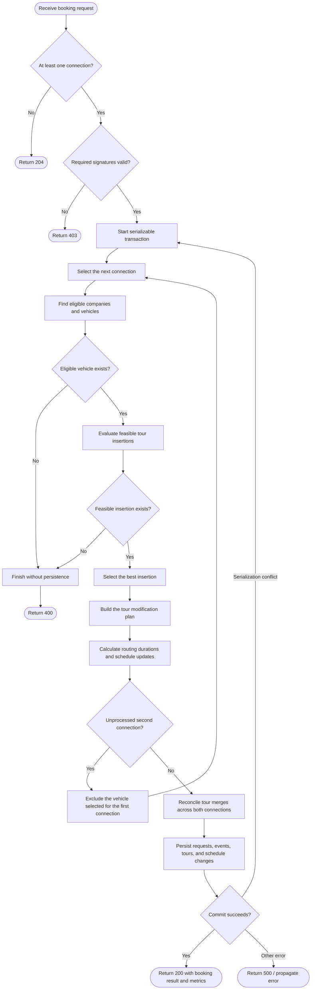

# Booking API flow

```mermaid
flowchart TD
    start([Receive booking request]) --> hasConnection{At least one connection?}

    hasConnection -- No --> noContent([Return 204])
    hasConnection -- Yes --> signatures{Required signatures valid?}
    signatures -- No --> forbidden([Return 403])
    signatures -- Yes --> transaction[Start serializable transaction]

    transaction --> chooseConnection[Select the next connection]
    chooseConnection --> availability[Find eligible companies and vehicles]
    availability --> eligible{Eligible vehicle exists?}
    eligible -- No --> bookingFailed[Finish without persistence]

    eligible -- Yes --> evaluate[Evaluate feasible tour insertions]
    evaluate --> feasible{Feasible insertion exists?}
    feasible -- No --> bookingFailed

    feasible -- Yes --> select[Select the best insertion]
    select --> plan[Build the tour modification plan]
    plan --> schedule[Calculate routing durations and schedule updates]

    schedule --> secondConnection{Unprocessed second connection?}
    secondConnection -- Yes --> excludeVehicle[Exclude the vehicle selected for the first connection]
    excludeVehicle --> chooseConnection

    secondConnection -- No --> reconcile[Reconcile tour merges across both connections]
    reconcile --> persist[Persist requests, events, tours, and schedule changes]
    persist --> commit{Commit succeeds?}
    commit -- Serialization conflict --> transaction
    commit -- Yes --> success([Return 200 with booking result and metrics])
    commit -- Other error --> serverError([Return 500 / propagate error])

    bookingFailed --> badRequest([Return 400])
```
