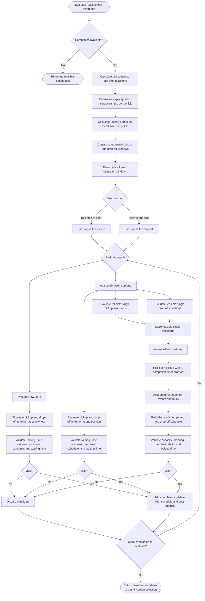

# Booking API insertion evaluation flow

This flowchart expands point 5, **Evaluate feasible tour insertions**, from the main
[booking API flow](./booking-api-flow.md).

```mermaid
flowchart TD
    start([Evaluate feasible tour insertions]) --> companies{Companies available?}
    companies -- No --> noCandidates([Return no feasible candidates])
    companies -- Yes --> directRouting[Calculate direct user-to-bus-stop durations]

    directRouting --> ranges[Determine capacity-valid insertion ranges per vehicle]
    ranges --> insertionRouting[Calculate routing durations for all insertion points]
    insertionRouting --> requestWindows[Construct requested pickup and drop-off windows]
    requestWindows --> operationWindows[Determine allowed operating windows]

    operationWindows --> direction{Taxi direction}
    direction -- Bus stop to user --> busStopPickup[Bus stop is the pickup]
    direction -- User to bus stop --> busStopDropoff[Bus stop is the drop-off]

    busStopPickup --> evaluationPaths
    busStopDropoff --> evaluationPaths

    evaluationPaths{Evaluation path}

    evaluationPaths --> newTour[evaluateNewTours]
    newTour --> evaluateNewTour[Evaluate pickup and drop-off together as a new tour]
    evaluateNewTour --> validateNewTour[Validate routing, time windows, promises, schedule, and waiting time]
    validateNewTour --> newTourCandidate{Valid?}
    newTourCandidate -- Yes --> candidates[Add complete candidate with schedule and cost metrics]
    newTourCandidate -- No --> discard[Discard candidate]

    evaluationPaths --> singleInsertions[evaluateSingleInsertions]
    singleInsertions --> samePosition[Evaluate pickup and drop-off together at one position]
    samePosition --> validateTogether[Validate routing, time windows, promises, schedule, and waiting time]
    validateTogether --> togetherCandidate{Valid?}
    togetherCandidate -- Yes --> candidates
    togetherCandidate -- No --> discard

    singleInsertions --> pickupSingles[Evaluate feasible single pickup insertions]
    singleInsertions --> dropoffSingles[Evaluate feasible single drop-off insertions]
    pickupSingles --> singleResults[Store feasible single insertions]
    dropoffSingles --> singleResults

    singleResults --> pairInsertions[evaluatePairInsertions]
    pairInsertions --> pairPositions[Pair each pickup with a compatible later drop-off]
    pairPositions --> interveningEvents[Account for intervening events and tours]
    interveningEvents --> pairSchedule[Build the combined pickup and drop-off schedule]
    pairSchedule --> validatePair[Validate capacity, ordering, promises, shifts, and waiting time]
    validatePair --> pairCandidate{Valid?}
    pairCandidate -- Yes --> candidates
    pairCandidate -- No --> discard

    discard --> moreCandidates{More candidates to evaluate?}
    moreCandidates -- Yes --> evaluationPaths
    moreCandidates -- No --> finish

    candidates --> moreCandidates
    finish([Return feasible candidates to best-insertion selection])
```
